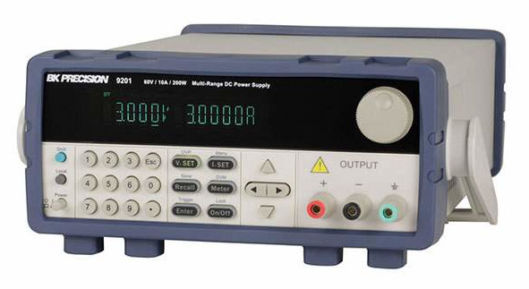

# BK9201 Python Demo

Demo code showing how to control the B&K 9201 Programmable Power Supply with Python code.
We will use pyvisa instead of direct USB or RS-232 serial.

We will be connecting the B&K 9201 through a USB cable, but pyvisa is useful because the
same code can be used for USB, GPIB, or RS-232 instruments.



## Python modules needed

Install these Python modules:

    pip install pyvisa
    pip install pyvisa-py
    pip install pyusb

The last part installs the USB backend pyvisa needs.

## Linux: add user to plugdev, add udev rule

If using Linux, add your user to group `plugdev`:

1. Add your user to group "plugdev" (USB device users). Example:

```bash
sudo addgroup myuser plugdev
```

2. Add a udev rule, for example create /etc/udev/rules.d/22-bk-9200-power-supply.rules with contents:

```
# B&K 920x Power Supply, give read/write permissions to group plugdev

SUBSYSTEMS=="usb", ACTION=="add", ATTRS{idVendor}=="ffff", ATTRS{idProduct}=="9200", GROUP="plugdev", MODE="0660"
```
This gives permissions to the group for that USB device.

## Setup USB interface

The B&K 9201 defaults to RS-232 interface. Use the front-panel buttons to change the
interface to USB. See the [user manual](https://bkpmedia.s3.amazonaws.com/downloads/manuals/en-us/9200_Series_manual.pdf)
for details on how to do this.

### Confirm device connected

Use `dmesg | tail` to verify that Linux has indeed attached the device.

### Confirm correct permissions

Use `lsusb` to find which USB bus the device is on. Look for `ffff:9200` (USB Vendor ID and 
Product ID of B&K 9201), like this:

```
$ lsusb
Bus 001 Device 002: ID 17ef:3074 Lenovo 
Bus 001 Device 011: ID ffff:9200
Bus 001 Device 001: ID 1d6b:0002 Linux Foundation 2.0 root hub
```

In the example above, device was found on bus 001 as device 011. Use the bus and device
number to check the permissions:

```
$ ls -l /dev/bus/usb/001/011
crw-rw-r-- 1 root plugdev 189, 10 Feb 13 12:19 /dev/bus/usb/001/011
```

It should show that the device is on group `plugdev` and the group has 
read-write permissions to it.

## Determine resource string, needed to specify which device

You need to know what the resource string is to use when you refer to 
the instrument in your code. You can use a short Python program to list
the instruments pyvisa found:

```python
import visa
rm = visa.ResourceManager()
for line in rm.list_resources():
    print line
```

With B&K Precision 920x connected via USB, you will see something like this:

```
$ python list_resources.py 
ASRL/dev/ttyS4::INSTR
USB0::65535::37376::802243020737510059::0::INSTR
```

The resource string you will need is the one that looks like below, except the long
serial number will be unique to your device:

    USB0::65535::37376::802243010737220006::0::INSTR

## Python to send SCPI commands

You then use pyvisa to send SCPI commands like the demo code below. **Change the code for
the specific resource string of your device.**

```python
import visa
rm = visa.ResourceManager()
pwr = rm.open_resource('USB0::65535::37376::802243010737220006::0::INSTR')

# Put device into remote control mode
pwr.write('SYST:REM')

# Set voltage to 5V
pwr.write('SOUR:VOLT 5.0')

# Set current to 1A
pwr.write('SOUR:CURR 1.0')

# Enable the output. '1' or 'ON' for enable, '0' or 'OFF' for disable.
pwr.write('SOUR:OUTP:STAT 1')
```

## SCPI command reference

For the B&K 9201 Power Supply, the [user manual](https://bkpmedia.s3.amazonaws.com/downloads/manuals/en-us/9200_Series_manual.pdf)
contains details on the SCPI commands supported.

